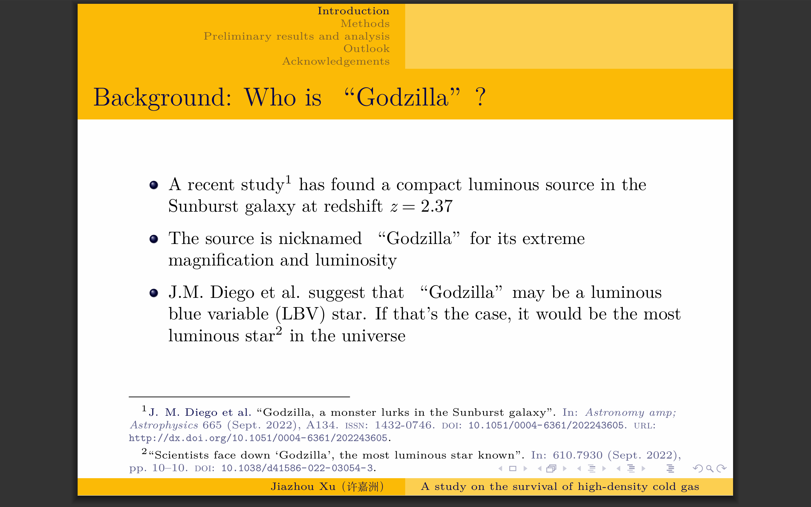
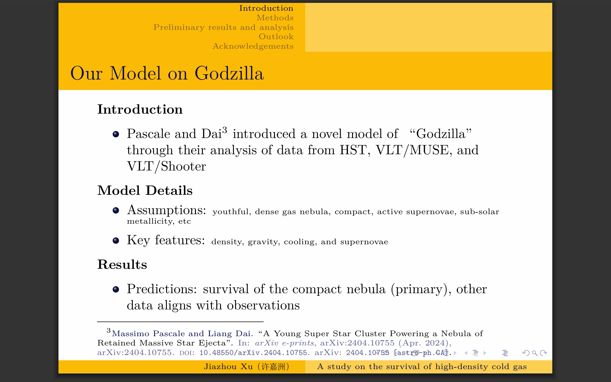
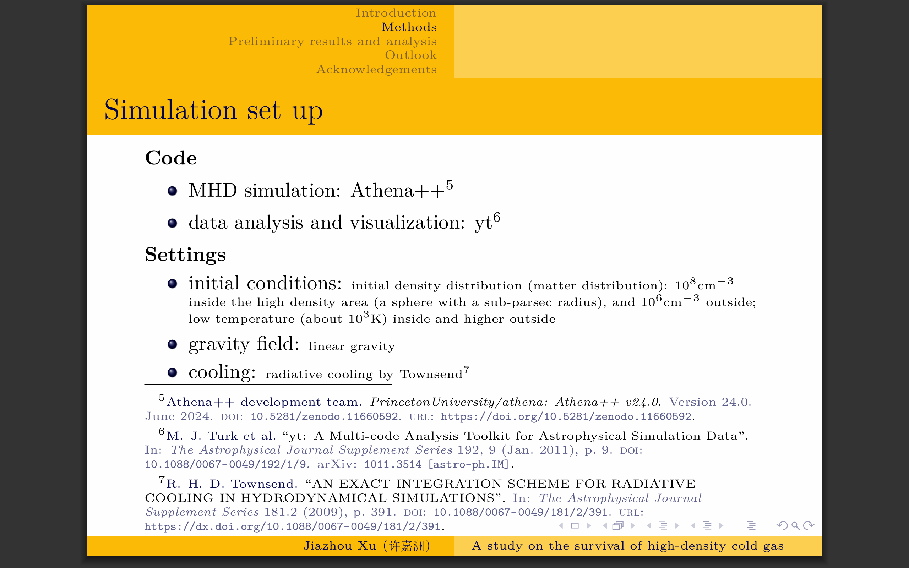
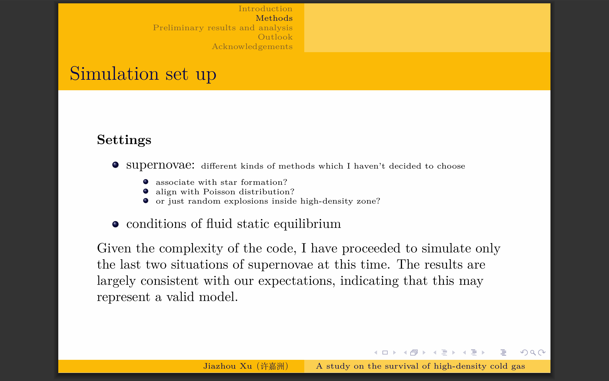

I proposed my preliminary results at Suoqing's group. Below are several selected slides. I also produced an [animation](JiazhouXu.github.io\assets\density_evolution24fps(outflow_Poisson_ver1.0).mp4) to show how the gas density evolve.

